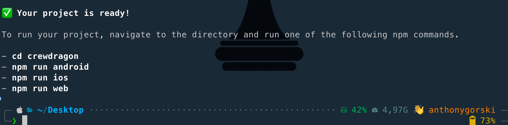
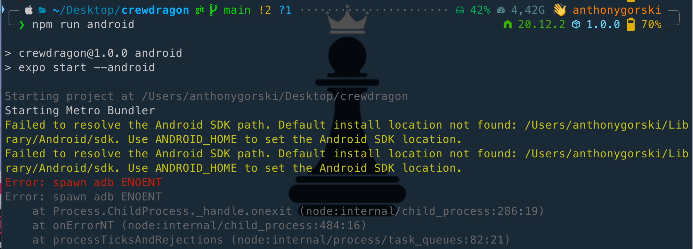
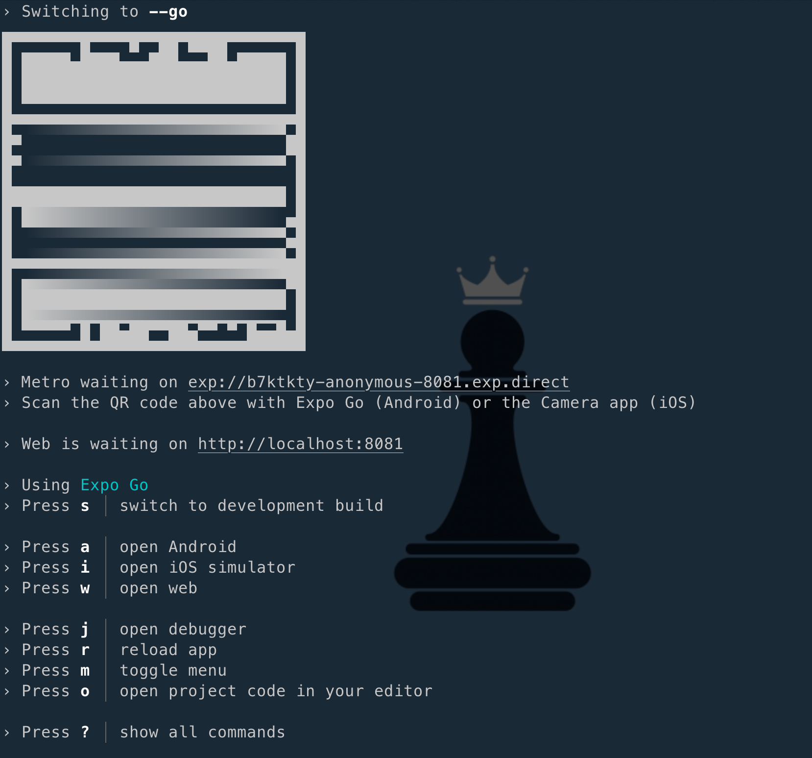
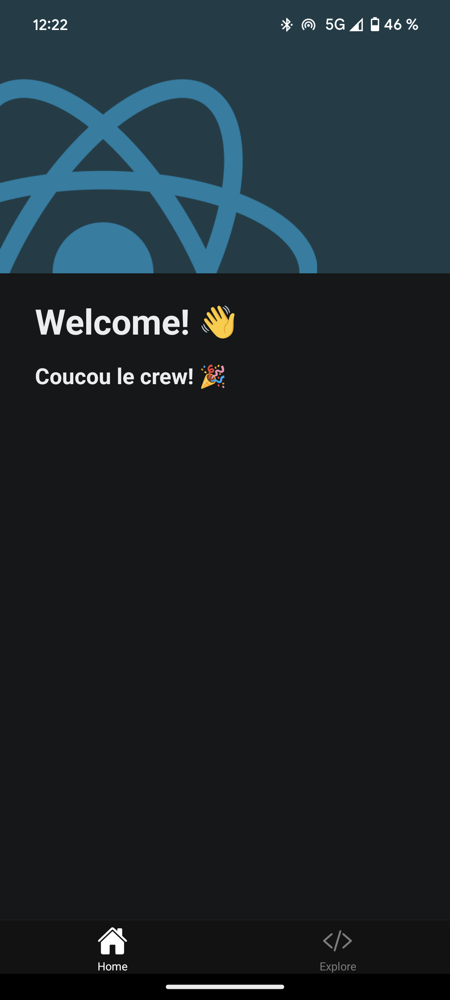

# React native !

Alors pour faire ce repo, je me suis rendu sur la documentation officiel de React Native, et j'ai suivi les instructions pour créer un projet.

-   [Installation](https://reactnative.dev/docs/environment-setup)
-   [Expo](https://docs.expo.dev/get-started/create-a-project/)

```shell
npx create-expo-app@latest my-new-project
```



```shell
cd my-new-project
npm run android
```

## Oups 😱



Pas de panique, ils le savent déjà, voilà la solution (sur leur site bien sûr 😅)

```shell
npx expo start --tunnel

# Using the Tunnel connection type will make the app reloads considerably slower than on LAN or Local, so it's best to avoid tunnel when possible. You may want to install and use an emulator or simulator to speed up development if Tunnel is required to access your machine from another device on your network.
```



Ensuite, on relance la commande `npm run android` et voilà le résultat. (j'ai juste modifier le fichier le fichier `index.tsx` dans `app/(tabs)/index.tsx`)


